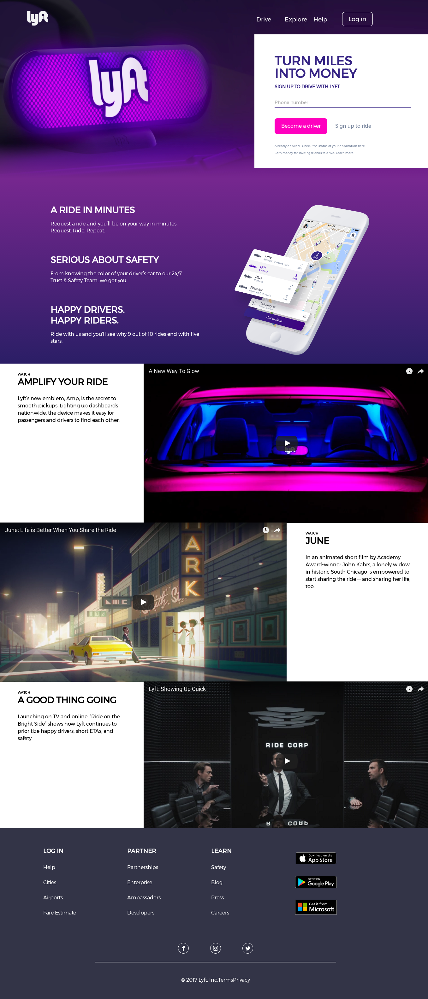

# Lyft-ProyectoSprint03
_Proyecto Final | Sprint 3_

## Requerimientos
**La página muestra la información de la empresa y cuenta con secciones como:**
  1. **nav**
  - [x] Al bajar el nav, pasa de ser transparente a tener fondo de color blanco y el botón de Sing up aparece.
  2. **section(registro-formulario)**
  - [x] Al hacer click en el input de "teléfono", este se extiende y aparecen los demás campos para el registro(teléfono, nombre, email,ciudad).
  - [x] Todos lo campos deben de estar validados.
    - El teléfono debe de tener sólo números para estar correcto
    - Los inputs de nombre y ciudad solo deben aceptar letras, y la primera letra debe d estar en mayúscula.
    - El input de email tiene que tener un formato de correo válido.
  3. **información**
  4. **videos**
    - [x] Los videos son enlazados de Youtube, es decir, que si le damos click lo reproducirá.
  5. **footer**
    - [x] El footer consta de diversos lonks, al hacer hover a cada link se cambian de color, también consta de imágenes e íconos.
    
## Vista Desktop
    

Mira cómo quedó haciendo click [aquí](https://lesashley.github.io/Lyft-ProyectoSprint03/).

[Leslie Avendaño](https://github.com/lesashley)

 
